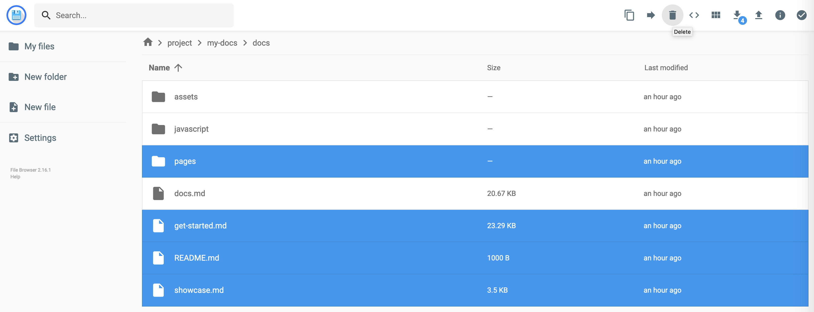
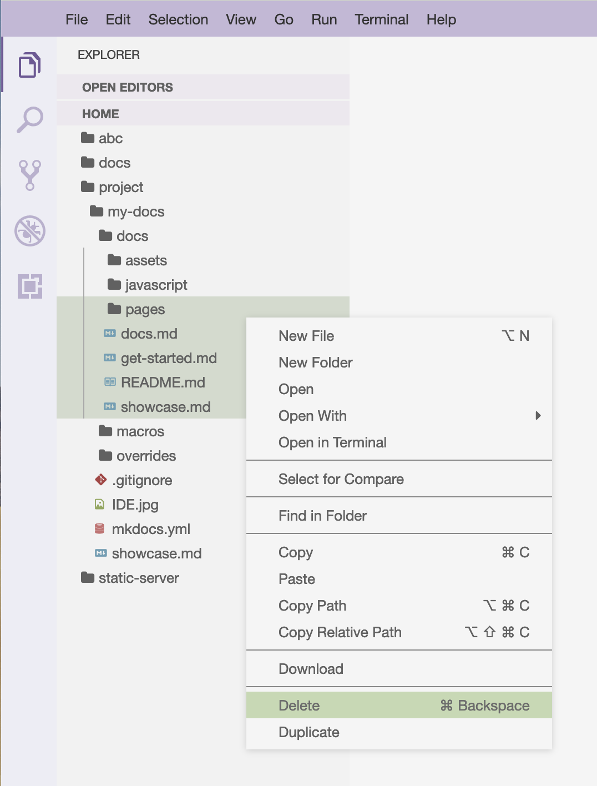
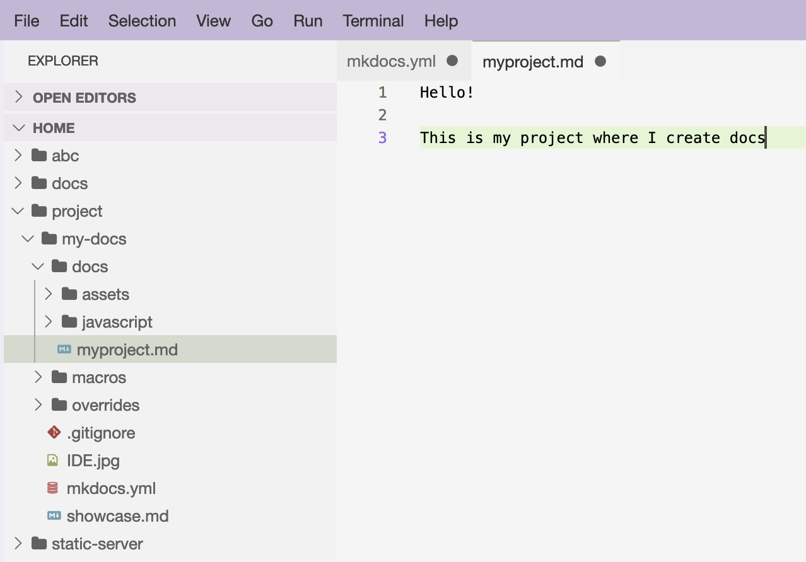

Getting started with MkDocs-MagicSpace is extremely easy. It already has everything needed: tools, 
packages and extensions for the Extended Markdown (and more advanced features), documentation and tutorials, 
and even a boilerplate.  

*(Let's assume that you have started MkDocs-MagicSpace on your laptop or remote server. If not, read the Docs first)*{style="color: grey"}

## MkDocs

MkDocs-MagicSpace is based on the popular open-source static site generator [MkDocs](https://www.mkdocs.org).  

MkDocs project - is a folder in your MkDocs-MagicSpace workspace, which must have the following minnimal structure 

```
mkdocs.yml    # The configuration file.
docs/
    index.md  # The documentation homepage.
    ...       # Other markdown pages, images and other files.
```

When you `cd` into the MkDocs project folder, 2 commands to remember:

* `mkdocs serve -a 0.0.0.0:<PORT>` - Start the live-reloading docs server.
* `mkdocs build -d <OUTPUT_PATH>` - Build the documentation site.

For the full documentation visit [mkdocs.org](https://www.mkdocs.org).

## Create your Mkdocs project

MkDocs-MagicSpace contains a boilerplate documentation project, which you can use to get started. It is the same project, that serves the workspace UI, 
the one you might use it to document the workspace itself. Simply copy it to the project folder, and customize it as you wish.   

Open MkDocs-MagicSpace terminal, and execute

```
cp -r /home/docs /home/project/my-docs
```

!!! success ""
    *Great! You have started your own documentation project!*

Start the Mkdocs development server on any of the free ports in the port range you have provided for the workspace

```
cd /home/project/my-docs; mkdocs serve -a 0.0.0.0:8030
```

Open your Browser on [localhost:8030](localhost:8030)

!!! warning "Tricky ports"
    If you have used the default port range to run the MkDocs-MagicSpace *(8020-8035:8020-8035)* then the internal port you use to run the mkdocs server 
    (`mkdocs serve -a 0.0.0.0:8030`) is the same as the external port - 8030. If you have used different port ranges, you will need to understand to which external port, 
    the internal ports are mapped. Let's imagine we used different port range to start MkDocs-MagicSpace, for example, `9070-9085:8020-8035`. In this case, internal port 8030 will map 
    to external port 9080. So when you start the mkdocs server (in the workspace terminal) on port 8030 (as in `mkdocs serve -a 0.0.0.0:8030`), then 
    you need to open in your browser `http://localhost:9080`  


## Customize boilerplate

The boilerplate you have copied to start your own project contains pages you might not need. You can modify them, or simply delete and create your own.  

When you work with Mkdocs, you create websites using [Markdown](https://www.markdownguide.org/). Mkdocs renders *.md* from the `docs` subfolder of the project, and you specify 
which `.md` files to show (and in which order) in the `mkdocs.yml` file in the root of the project folder.   

Let's delete all existing markdown files from the boilerplate folder. To do this you can use Filebrowser, Theia IDE, M.Commander, or just terminal. The easiest way - is to use filebrowser, 
which is well-suited to manipulate workspace filesystem, and to easily exchange files and folders between the outer environment and the workspace. Filebrowser provides the same user experience, 
no matter if the workspace is running on your laptop, or launched in the cloud server). 

{style="height: 100%; width: 100%; border-radius: 5px;" loading=lazy} 

It is convenient to use IDE for this too  :point_down: 

{style="height: 50%; width: 50%; border-radius: 5px; margin-left: auto; margin-right: auto; display: block;" loading=lazy}

We need to remove references to these markdown files from the `mkdocs.yml` file too

**mkdocs.yml**

```{.yaml hl_lines="6-9"}
# ===========================================================
# NAVIGATION
# ===========================================================

nav:
  - Home: pages/home/home.md
  - About: README.md
  - Get started: get-started.md
  - Showcase: showcase.md
```

Let's create our own new markdown file in the same `docs` subfolder :point_down: 

{style="height: 75%; width: 75%; border-radius: 5px; margin-left: auto; margin-right: auto; display: block;" loading=lazy}

And add a reference to this markdown file in the `mkdocs.yml` file

**mkdocs.yml**

```{.yaml hl_lines="6"}
# ===========================================================
# NAVIGATION
# ===========================================================

nav:
  - My Project: myproject.md
```
Save ++ctrl+s++ the files you have created and modified. Mkdocs server will reload automatically, and in couple of seconds you will see that new changes 
are applied.