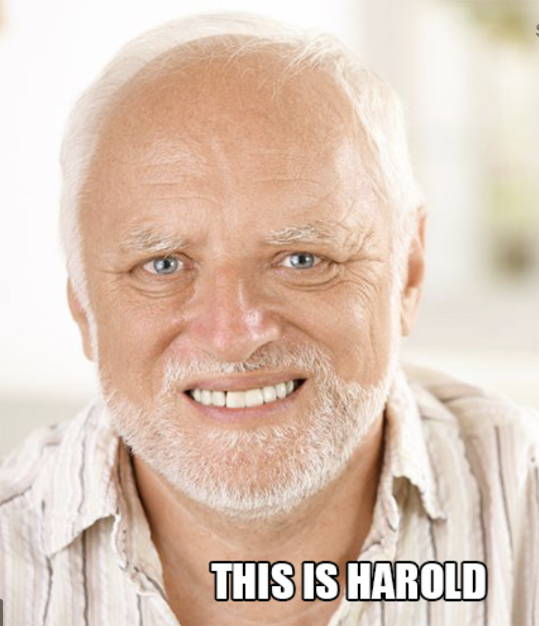
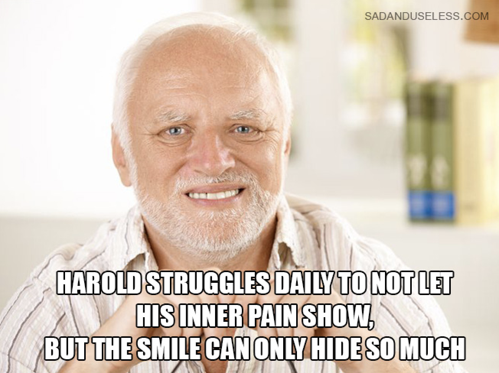

---
hide:
  - toc
---

Standard Markdown allows the addition of images to the page.
 Both local images, and images from the Internet can be displayed on the Markdown pages

!!! example "Hide the pain Harold"
    === "Output"   
        {loading=lazy}
    === "Markdown"
        ```
        
        ```

Extended Markdown allows centering and styling the images with [Attribute lists](hack-markdown.md)

!!! example "Image left"
    === "Output"   
        { align=left style="height: 30%; width: 30%; border-radius: 5px; box-shadow: rgba(0, 0, 0, 0.24) 0px 5px 5px;" loading=lazy}
        # Hide the Pain Harold is the meme of the decade (according to Imgur).   
        ## Hungarian legend András Arató found fame after he was turned into a meme for his seemingly pained smiling expression.
    === "Markdown"
        ```
        { align=left style="height: 30%; width: 30%; border-radius: 5px;" loading=lazy}
        # Hide the Pain Harold is the meme of the decade (according to Imgur).   
        ## Hungarian legend András Arató found fame after he was turned into a meme for his seemingly pained smiling expression.
        ```


!!! example "Image right"
    === "Output"   
        { align=right style="height: 40%; width: 40%; border-radius: 5px; box-shadow: rgba(0, 0, 0, 0.24) 0px 5px 5px;" loading=lazy}
        ## All he was doing was posing for stock photos and was doing his best to look natural. However, people picked up on his facial expressions and he's since become one of the most recognisable memes on the internet. 
    === "Markdown"
        ```
        { align=right style="height: 40%; width: 40%; border-radius: 5px;" loading=lazy}
        ## All he was doing was posing for stock photos and was doing his best to look natural. 
        However, people picked up on his facial expressions and he's since become 
        one of the most recognisable memes on the internet. 
        ```

