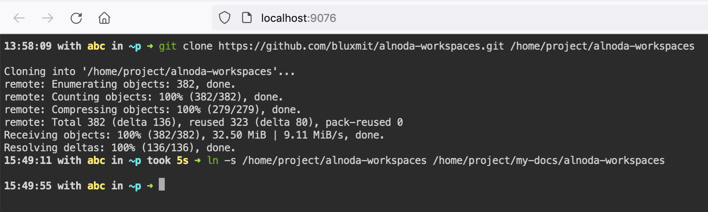
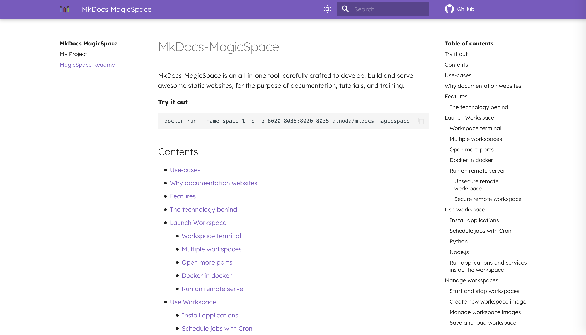
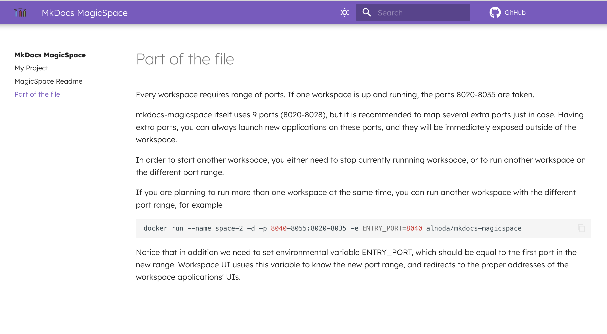

!!! success ""
    One of the very useful features of the MkDocs-MagicSpace - is its abilty to include *.md* files from 
    many git repositories (public and private). This helps you to create easily a single unified documentation 
    website, which includes doc files from the source-code repositories.  

## Add another repository to the project

1. Open terminal of the MkDocs-MagicSpace, and clone the repository to `/home/project`

```
git clone https://github.com/bluxmit/alnoda-workspaces.git /home/project/alnoda-workspaces
```

2. In the `docs` folder of your mkdocs project, create symlink to the cloned repo folder. 
Assuming your mkdocs project has path `/home/project/my-docs`

```
ln -s /home/project/alnoda-workspaces /home/project/my-docs/docs/alnoda-workspaces
```

{style="height: 100%; width: 100%; border-radius: 5px; margin-left: auto; margin-right: auto; display: block;" loading=lazy}

## Include Markdown files from another repository

Now you can add *.md* files from the GitHub repo as if they were in your mkdocs project. 
Simply add entry to the `mkdocs.yml` to include any markdown file from the repository   

**mkdocs.yml**

```{.yaml hl_lines="7"}
# ===========================================================
# NAVIGATION
# ===========================================================

nav:
  - My Project: myproject.md
  - MagicSpace Readme: alnoda-workspaces/workspaces/mkdocs-magicspace/README.md
```

!!! warning 
    The path to the *.md* file that we include in the file **mkdocs.yml** is relative to the `docs` 
    subfolder, which is in your Mkdocs project directory

Voila! the Markdown file from another Git repository is included in your documentation website

{style="height: 75%; width: 75%; border-radius: 5px; margin-left: auto; margin-right: auto; display: block;" loading=lazy} 

## Include parts of the Markdown files 

Let's create a page in our doc website, and this page will include only part of the save README.md file from the previous section.  

First, create mew empty file `part-of-the-file.md` (in the `docs` subfolder of the Mkdocs project), and add reference to the `mkdocs.yml` 

**mkdocs.yml**

```{.yaml hl_lines="8"}
# ===========================================================
# NAVIGATION
# ===========================================================

nav:
  - My Project: myproject.md
  - MagicSpace Readme: alnoda-workspaces/workspaces/mkdocs-magicspace/README.md
  - Part of the file: part-of-the-file.md
```

Open file `part-of-the-file.md` (in the workspace IDE) and add the following code snippet 
without **`'`** in the `'{%'` (first line)! 

**docs/part-of-the-file.md**

```

'

```

This piece of code will include into the file `docs/part-of-the-file.md` from another Markdown 
file `docs/alnoda-workspaces/workspaces/mkdocs-magicspace/README.md` everything between 
headers **Multiple workspaces** and **Open more ports**   

{style="height: 75%; width: 75%; border-radius: 5px; margin-left: auto; margin-right: auto; display: block;" loading=lazy}


