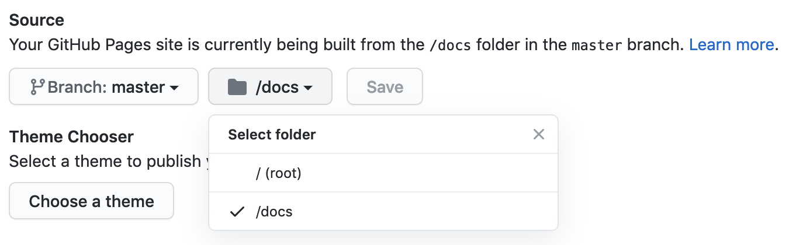

One of the easiest ways to go online with your website - is to publish it to GitHub pages. You just need to build 
and push the ready static documentation website to GitHub.   

!!! info
    GitHub Pages is available in public repositories with GitHub Free and GitHub Free for organizations, 
    and in public and private repositories with GitHub Pro, GitHub Team, GitHub Enterprise Cloud, 
    and GitHub Enterprise Server. 

Let's assume you git repository has a folder structure, where MkDocs project is 
in subfolder called `mkdocs`, i.e.

```
mkdocs/
    mkdocs.yml    # The configuration file.
    docs/
        index.md  # The documentation homepage.
    ...           # Other markdown pages, images and other files.
```

Let's now build website, with the output folder `docs` in the same repository root folder, as `mkdos` 

```
mkdocs build -d ../docs
```

The resulting folder structure of your repository is

```
docs/
    index.html 
    404.html
    ...
mkdocs/
    mkdocs.yml    # The configuration file.
    docs/
        index.md  # The documentation homepage.
    ...           # Other markdown pages, images and other files.
```

Commit these changes, and push to GitHub.  


Open your GitHub repository page, and perform the following actions:

- Under your repository name, click Settings

{style="height: 75%; width: 75%; border-radius: 5px; margin-left: auto; margin-right: auto; display: block;" loading=lazy}

- In the left sidebar, click Pages

{style="height: 50%; width: 50%; border-radius: 5px; margin-left: auto; margin-right: auto; display: block;" loading=lazy}

- Select branch `master`, folder `docs/` and click `Save`

{style="height: 75%; width: 75%; border-radius: 5px; margin-left: auto; margin-right: auto; display: block;" loading=lazy}

That's it! Your website is online

