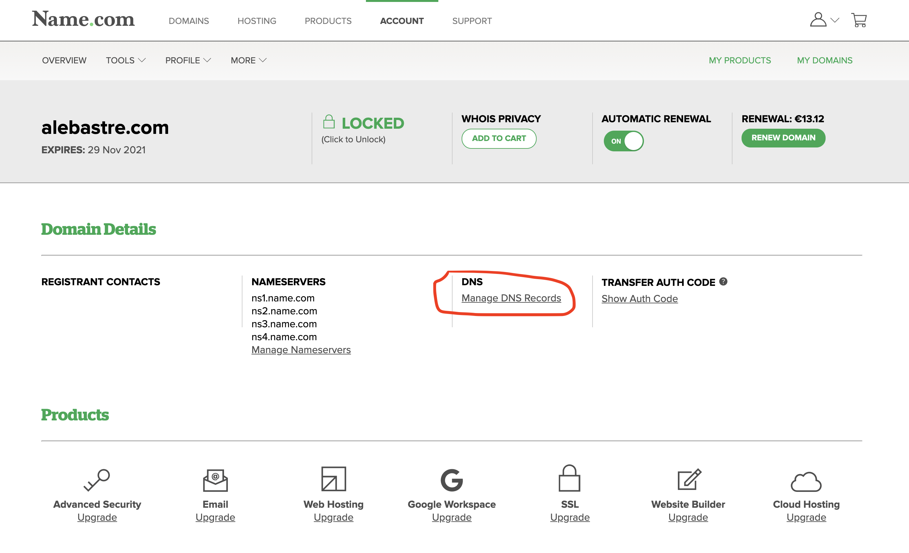
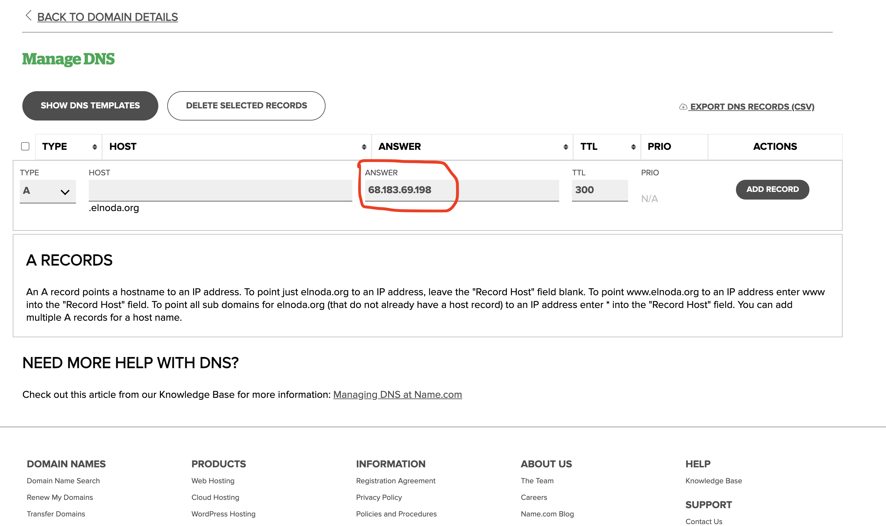

MkDocs-Magicspace can be used to serve documentation website too. 

## Get a server

For the documentation website to be online all the time, you need to get a cloud server. There are lots of cloud providers where 
you can buy a server easily, for instance [digitalocean.com](https://digitalocean.com), [linode.com](https://linode.com), [vultr.com](https://vultr.com), etc. 
You can also use services of *"big clouds"* like AWS, Google Cloud, MS Azure, etc., but it is harder if you are not familiar with any of them.  

Serving static website requires little resources, even if scale out Mkdocs-MagicSpace, and run several workspaces to ensure 
higher concurrency and better performance for your users. Server with 2 (V)CPU and 4 GB RAM will be enough. It usually costs around 5$ per month.  

**NOTE:** The server should have public IP in order to be accessible in the Internet.  

!!! tip
    If possible, chose server option that aleady has docker installed. Many cloud services already provide them.

!!! tip
    I recommend to choose Ubuntu as OS 


If the server does not come with docker, we need to install it. [Install docker on Ubuntu 18](https://docs.docker.com/engine/install/ubuntu/), 
and [install docker-compose](https://docs.docker.com/compose/install/)

## Domain name

In order to publish your documentation website you need to get a domain name. There are a lot of services where you can do that, 
for example [name.com](https://name.com), [namecheap.com](https://namecheap.com) etc.   

After you buy a domain name, find in the website of your domain provider how to add ***"A-record"*** that will point to the ***IP*** 
of your server.   

This is how it looks on [name.com](https://name.com)  

{style="height: 100%; width: 100%; border-radius: 5px; margin-left: auto; margin-right: auto; display: block;" loading=lazy}

{style="height: 100%; width: 100%; border-radius: 5px; margin-left: auto; margin-right: auto; display: block;" loading=lazy}

## Create docker image from workspace

Commiting workspace - is creating a new docker image from your workspace with all the work and changes you've done in this workspace. 
After image is created, you will be able to create many copies of your workspace from this image. You can also create different 
versions of your workspace by committing at different moments of time.  

In oder to commit image open terminal on the server, laptop or PC where worrkspace is running. Assuming the name of your 
workspace is **space-1**, execute 

```
docker commit space-1 ready-website:0.1
```

where *0.1* is a version.  

This image can already be used to deploy and serve static website. But it is not optimal: we only need static server to run and serve the website, 
and workspace starts many applications, including IDE, Cronicle, Filebrowser and other. We will delete those applications in the final image.  

Create Dockerfile

```
FROM ready-website:0.1

USER root

RUN rm -rf /home/project
RUN rm -rf /opt/cronicle
RUN rm -rf /opt/filebrowser
RUN rm -rf /opt/theia
RUN rm -rf /opt/ungit

RUN apt-get remove -y docker docker-engine docker.io containerd runc nano mc git gitflow ncdu

USER abc

```

And make new more optimized image 

```
docker build -t ready-website:0.2 .
```


## Deploy

In order to deploy documentation website with Mkdocs-MagicSpace you will need to perform only the following 2 steps:

1. Get workspace image on the cloud server
2. Launch workspace in production

### Get workspace image on the cloud server

Unless you are already developing in the remote workspace on the same server you want to deploy your documentation website, 
you will need to get the image of this workspace on the remote server. The best way - is to use private docker registry, that 
you can buy from many docker registry providers and cloud services (you can buy it even on [hub.docker.com](https://hub.docker.com/) itself)   

!!! warning
    It is not recommended to use free public docker registry, because it is ***public***, 
    and anyone can pull and open your workspace. 

I've got a private registry on docker hub, called alnoda/ready-website, and pushing image to the registry is as easy as 

```
docker tag ready-website:0.1 alnoda/ready-website:0.2
docker push alnoda/ready-website:0.2
```

On the colud server I simply login to the docker registry, and execute 

```
docker pull alnoda/ready-website:0.2
```

Easy! Now workspace image with the documentation website is on the cloud server ready to be deployed.  

### Launch workspace in production

We use [Traefik](https://doc.traefik.io/traefik/https/tls/) to take care of TLS certificates and HTTPS. That is the reason why we start 
workspace in production together with Traefic service using docker-compose.   

!!! tip
    Configuring load balancer/reverse proxy is not an extremely easy task, that's why Mkdocs-MagicSpace comes with a small 
    utility that will do it for you. 
    
In order to generate a production-ready `docker-compose.yml` file, open terminal in the running Mkdocs-MagicSpace, and execute 

```
python /home/abc/utils/staticserver.py --image="alnoda/ready-website:0.1" --domain="<YOUR DOMAIN>" --email="<YOUR EMAIL>" --homepage="my-website/"
```

**NOTE:** argument --homepage="my-website/" is a path to the website in the Static File Server

{style="height: 50%; width: 50%; border-radius: 5px; margin-left: auto; margin-right: auto; display: block;" loading=lazy}

You see that a file `docker-compose.yml` is generated. Copy this file to the cloud server, and execute 

```
docker-compose up -d
```

You are live! Open your browser, and navigate to your domain.