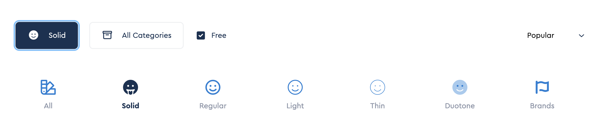
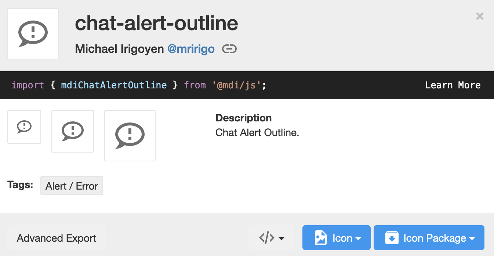
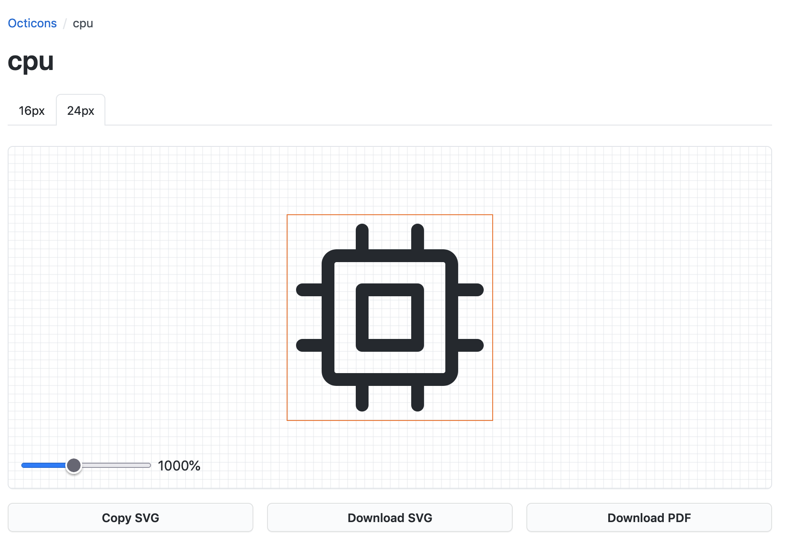

## Emoji and Icons

Make your docs look classy and fun to read by using beautiful icons and emoji. There are thousands of them, and you will always find 
what you need.

Yo can include emoji in your markdown text using special words. 
For example, simply adding ```:smile:``` right to the markdown text, will make this smily face :smile: show up

There are lots of emoji (thousand) available out of the box

!!! example "Examples of Emoji"
    === "Output"
        :smile: :heart: :thumbsup: :100: :muscle: :accept: :point_up: :airplane: :champagne: :raised_hands: :boom: :laughing: :metal: :handshake: :older_man: :sheep: :no_entry: :mouse: :relieved: :question: :wink: :wave: :rainbow: :sleeping:  

        :point_right: [The full list of short emoji names](https://github.com/facelessuser/pymdown-extensions/blob/main/pymdownx/emoji1_db.py)  
    === "Markdown"
        ```
        :smile: :heart: :thumbsup: :100: :muscle: :accept: :point_up: :airplane: :champagne: :raised_hands: :boom: :laughing: :metal: :handshake: :older_man: :sheep: :no_entry: :mouse: :relieved: :question: :wink: :wave: :rainbow: :sleeping:  

        :point_right: [The full list of short emoji names](https://github.com/facelessuser/pymdown-extensions/blob/main/pymdownx/emoji1_db.py)  
        ```
    
Same as with emoji, you can include fancy icons in your markdown documents. You can use icons from the following icon sets:

1. :fontawesome-regular-dizzy: - **Font Awesome**
2. :material-alien-outline: - **Material Design Icons**
2. :octicons-rocket-24: - **Octicons**

??? hint "Getting icon from Font Awesome"
    Open [**Font Awesome icon explorer web page**](https://fontawesome.com/v6.0/icons)   

    Chose only ```free``` icons to show, select one of the categories: ```regular```, ```solid```, ```light```, ```thin```, ```brands```  

    {style="box-shadow: rgba(0, 0, 0, 0.24) 2px 0px 5px;"}

    Pick up any icon from the selected category - each of them has name, for example icon ```video``` from the category ```solid```     

    {style="box-shadow: rgba(0, 0, 0, 0.24) 2px 0px 5px; border-radius: 5px; align: center; width: 100px; height: 70px; display: block; margin-left: auto; margin-right: auto;", loading=lazy}

    Combine words ```fontawesome```, ```solid``` and ```video``` to create the short icon name:  ```:fontawesome```-```solid```-```video:``` Add this name to the markdown text, and the icon :fontawesome-solid-video: is showing up

    
??? hint "Getting icon from Material Design"
    Open [**Material Design Icons explorer**](https://materialdesignicons.com/)

    Find an icon, for example ```chat-alert-outline```  

    {style="box-shadow: rgba(0, 0, 0, 0.24) 2px 0px 5px; border-radius: 5px; align: center; width: 50%; height: 50%; display: block; margin-left: auto; margin-right: auto;", loading=lazy}

    Combine words ```material``` and ```chat-alert-outline``` to create the short icon name:  ```:material```-```chat-alert-outline:``` Add this name to the markdown text, and the icon :material-chat-alert-outline: is showing up


??? hint "Getting icon from Octicons"
    Open [**Octicons explorer**](https://primer.style/octicons/)

    Find an icon, for example ```cpu``` 

    Chose the size: ```24px``` or ```16px``` 

    {style="box-shadow: rgba(0, 0, 0, 0.24) 2px 0px 5px; border-radius: 5px; align: center; width: 50%; height: 50%; display: block; margin-left: auto; margin-right: auto;", loading=lazy}

    Combine words ```octicons```, ```cpu``` and ```24``` to create the short icon name:  ```:octicons```-```cpu```-```24:``` Add this name to the markdown text, and the icon :octicons-cpu-24: is showing up


!!! example "Examples of icons"
    === "Output"
        :fontawesome-brands-medium: :fontawesome-brands-facebook: :fontawesome-solid-book-open: :fontawesome-regular-snowflake: :material-google-maps: :material-guy-fawkes-mask: :fontawesome-brands-youtube-square: :material-check-circle: :material-arrow-right: :fontawesome-solid-user: :fontawesome-solid-paper-plane: :fontawesome-solid-ship: 

        :fontawesome-brands-firefox:{style="color: orange; font-size: 40px;"}
    === "Markdown"
        ```
        :fontawesome-brands-medium: :fontawesome-brands-facebook: :fontawesome-solid-book-open: :fontawesome-regular-snowflake: :material-google-maps: :material-guy-fawkes-mask: :fontawesome-brands-youtube-square: :material-check-circle: :material-arrow-right: :fontawesome-solid-user: :fontawesome-solid-paper-plane: :fontawesome-solid-ship:

        :fontawesome-brands-firefox:{style="color: orange; font-size: 40px;"} 
        ```
    

??? hint "Smart symbols"
    There are several symbols that be will automatically beautified without any additional actions

    Markdown       | Result
    -------------- |--------
    `(tm)`         | (tm)
    `(c)`          | (c)
    `(r)`          | (r)
    `c/o`          | c/o
    `+/-`          | +/-
    `-->`          | -->
    `<--`          | <--
    `<-->`         | <-->
    `=/=`          | =/=
    `1/4, etc.`    | 1/4, etc.
    `1st 2nd etc.` |1st 2nd etc.

[Find any icon or emoji easily!](https://squidfunk.github.io/mkdocs-material/reference/icons-emojis/#search){ .md-button .md-button--primary } :point_left:


## Abbreviations
FYI abbreviations that are familiar to you might confuse other people. Make it simpler for everyone 

!!! example "Abbreviation"
    === "Output"
        The dumbest message I've ever recieved:  "OK IDK FWIW IMHO RTFM ROTFLMAO JK ILY TTFN" 

        *[IDK]: I don't know
        *[FWIW]: for what it's worth
        *[IMHO]: in my humble opinion
        *[RTFM]: read the manual
        *[ROTFLMAO]: Rolling on the floor laughing
        *[JK]: Just kidding
        *[ILY]: I love you
        *[TTFN]: Ta ta for now

    === "Markdown"
        ```
        The dumbest message I've ever recieved:  "OK IDK FWIW IMHO RTFM ROTFLMAO JK ILY TTFN" 

        *[IDK]: I don't know
        *[FWIW]: for what it's worth
        *[IMHO]: in my humble opinion
        *[RTFM]: read the manual
        *[ROTFLMAO]: Rolling on the floor laughing
        *[JK]: Just kidding
        *[ILY]: I love you
        *[TTFN]: Ta ta for now
        ```
    


## Superscipt & Subscript
Wrap text around both sides with ```^``` to make it look like a superscript
!!! example "Superscript"
    === "Output"
        Sin^2^ + Cos^2^ = 1  

        2^e^

        ^$^80

        Googol = 10^100^

    === "Markdown"
        ```
        Sin^2^ + Cos^2^ = 1  

        2^e^

        ^$^80

        Googol = 10^100^
        ```

Wrap text around both sides with ```~``` to make it look like a subscript
!!! example "Subscript"
    === "Output"
        C~hex~ = 12~dec~ = 14~oct~

        C~2~H~5~0H 

        ^67^/~68~

    === "Markdown"
        ```
        C~hex~ = 12~dec~ = 14~oct~ 

        C~2~H~5~0H 

        ^67^/~68~
        ```


## Critic
- to {++insert text++} use \{\+\+insert text\+\+\} 
- to {--remove text--} use \{\-\-remove text\-\-\}
- to {~~substitute this~>with this~~} use \{\~\~substitute this\~\>with this\~\~\}
- to {==highlight text==} use \{\=\=highlight text\=\=\}
- to {==highlight text==}{>>with a comment<<} use \{\=\=highlight text\=\=}\{\>\>with a comment\<\<\}

!!! example "Critic"
    === "Output"
        We Uber drivers never know whom we’re going to end up with as a passenger {--in the same car--}. 
        One day, I was driving over a new bridge, the design of which was very {~~confusing~>ugly~~}. 
        Completely confounded, {==I muttered==}{>>Actually I said it out loud<<}, “I’d love to meet the {~~genius~>retard~~} 
        who designed this mess.” With that, my passenger {==extended his hand in my direction==}{>>I thought he wanted to choke me<<} 
        and said, “Well, today is your {--*very*--} lucky day. My name is Mike, I work for the county engineer’s office, 
        and I’m the {==genius==}{>>obviously an irony<<} who designed this!”. Surprisingly, he still gave me a tip {++**of 2 dollars**++}.  

    === "Markdown"
        We Uber drivers never know whom we’re going to end up with as a passenger \{\-\-in the same car\-\-\}. 
        One day, I was driving over a new bridge, the design of which was very \{\~\~confusing\~\>ugly\~\~\}. 
        Completely confounded, \{\=\=I muttered\=\=\}\{\>\>Actually I said it out loud\<\<\}, “I’d love to meet 
        the \{\~\~genius\~\>retard\~\~\} who designed this mess.” With that, 
        my passenger \{\=\=extended his hand in my direction\=\=\}\{\>\>I thought he wanted to choke me\<\<\} and said, 
        “Well, today is your \{\-\-\*very\*\-\-\} lucky day. My name is Mike, I work for the county engineer’s office, 
        and I’m the \{\=\=genius\=\=\}\{\>\>obviously an irony\<\<\} who designed this!”. 
        Surprisingly, he still gave me a tip \{\+\+\*\*of 2 dollars\*\*\+\+\}. 
    

## Keys
You can create beautiful styles for keyboard keys and key combinations just like this: ```++ctrl++``` yields  ++ctrl++   

!!! example "Beautiful Keys"
    === "Output"
        ++enter++   ++tab++   ++space++   ++arrow-up++  ++arrow-down++   ++page-up++    ++home++    ++backspace++    ++insert++

        ++alt++     ++right-alt++   ++left-command++    ++right-control++   ++fn++  ++shift++   ++left-shift++

        ++pipe++   ++backslash++    ++bar++     ++semicolon++   ++tilde++   ++underscore++

        ++brace-left++      ++brace-right++     ++bracket-left++    ++bracket-right++   ++double-quote++    ++single-quote++ 
        
        ++exclam++  ++comma++   ++equal++   ++less++    ++greater++   ++minus++

        ++1++   ++f9++   ++q++  ++num0++    ++num1++    ++num-lock++

        ++ctrl+alt+delete++

    === "Markdown"
        ```
        ++enter++   ++tab++   ++space++   ++arrow-up++  ++arrow-down++   ++page-up++    ++home++    ++backspace++    ++insert++

        ++alt++     ++right-alt++   ++left-command++    ++right-control++   ++fn++  ++shift++   ++left-shift++

        ++pipe++   ++backslash++    ++bar++     ++semicolon++   ++tilde++   ++underscore++

        ++brace-left++      ++brace-right++     ++bracket-left++    ++bracket-right++   ++double-quote++    ++single-quote++ 
        
        ++exclam++  ++comma++   ++equal++   ++less++    ++greater++   ++minus++

        ++1++   ++f9++   ++q++  ++num0++    ++num1++    ++num-lock++

        ++ctrl+alt+delete++
        ```
    

:point_right: [The complete list of keys](https://facelessuser.github.io/pymdown-extensions/extensions/keys/) 


